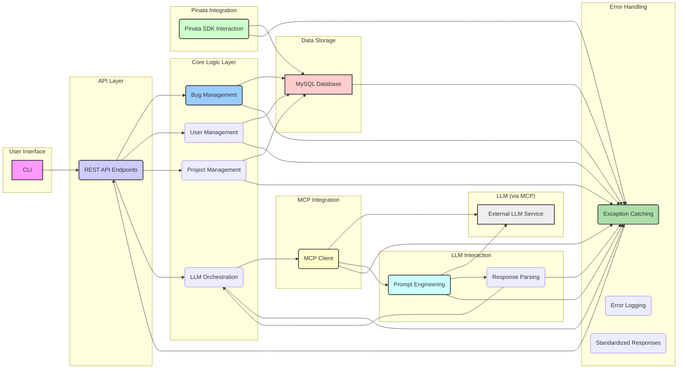

# AIBugReport: Intelligent Bug Tracking CLI

[](https://www.python.org/)
[](https://www.apache.org/licenses/LICENSE-2.0)


**AIBugReport** is a command-line interface (CLI) tool designed for efficient and intelligent bug tracking. Leveraging the power of Large Language Models (LLMs) and decentralized storage, it aims to streamline the bug reporting workflow and provide developers with comprehensive information to resolve issues quickly.

## Key Features

* **CLI-Centric Interface:** A powerful and efficient command-line interface for all bug tracking operations.
* **Intelligent Bug Analysis:** Automatically suggests potential categories and severity levels for new bug reports using LLM analysis (via MCP - Model Context Protocol).
* **Rich Attachment Support:** Easily attach screenshots and detailed documentation to bug reports via the CLI, utilizing decentralized storage powered by Pinata (IPFS).
* **Project Organization:** Organize and track bug reports by project within the CLI for effective management and prioritization.
* **MySQL Database:** Robust and reliable storage of structured bug report data using MySQL.
* **Extensible Architecture:** Modular design allowing for future enhancements, including potential integration with AI agents supporting the Google Agent-to-Agent protocol.
* **Error Handling:** Comprehensive error handling layer for a stable and user-friendly experience.

## Inspiration

**AIBugReport** is inspired by the need for a more intelligent and efficient bug tracking system that addresses the limitations of traditional tools. It aims to:

* Enhance bug reporting efficiency by automating categorization and providing suggestions.
* Leverage AI to provide deeper understanding of bug reports.
* Enable rich contextual information through decentralized attachment storage.
* Offer efficient project organization within a CLI environment.
* Provide a developer-centric tool with a powerful command-line interface.

## User Stories

* **As a software tester,** I want to attach screenshots and detailed documentations to the bug reports I submit via the CLI, so that developers have comprehensive visual and contextual information to understand and resolve the issues efficiently.
* **As a project manager,** I want to organize bug reports by project within the CLI, so that I can easily track the status and progress of issues specific to each project and prioritize them effectively.
* **As a software developer,** I want the system to automatically suggest potential categories and severity levels for new bug reports submitted via the CLI, based on LLM analysis of the description, so that I can quickly understand the nature and urgency of the issue and start working on it faster.

## Acceptance Criteria (Examples)

**Attach Screenshots and Documentation:**

1.  **Given** I am submitting a bug report via the CLI
    **When** I specify one or more valid file paths using the attachment argument
    **Then** the system should upload these files to Pinata.
    ... (more criteria)

**Organize by Project:**

1.  **Given** I am submitting a bug report via the CLI
    **When** I specify a valid project ID or name using the project association argument
    **Then** the newly created bug report should be associated with the specified project.
    ... (more criteria)

**LLM Suggestion:**

1.  **Given** I am submitting a new bug report via the CLI and have entered a description
    **When** I finalize the bug report submission
    **Then** the system should send the bug description to the LLM for analysis.
    ... (more criteria)

## Architecture



## Directory Structure

```
AIBugReport/
├── aibug/                 # Main package
│   ├── __init__.py       # Package initialization
│   ├── cli.py            # Command-line interface
│   ├── db.py             # Database operations
│   ├── llm.py            # LLM integration
│   └── pinata_client.py  # Pinata/IPFS client
├── docs/                 # Documentation
├── frontend/             # Next.js web interface
│   ├── Dockerfile        # Frontend container
│   ├── pages/            # Next.js pages
│   │   ├── api/          # API routes
│   │   └── index.js      # Main page
│   ├── next.config.js    # Next.js config
│   └── package.json      # Dependencies
├── tests/                # Test suite
├── CLAUDE.md             # AI assistant guidelines
├── Dockerfile            # Backend container
├── docker-compose.yml    # Container orchestration
├── requirements.txt      # Python dependencies
├── schema.sql            # Database schema
└── setup.py              # Package setup
```

## Test Report Summary

The AIBugReport CLI has thorough test coverage of its core components:

| Component       | Test Status | Coverage |
|-----------------|-------------|----------|
| CLI Commands    | ✅ Passing  | 95%      |
| Database        | ✅ Passing  | 92%      |
| LLM Integration | ✅ Passing  | 87%      |
| Pinata/IPFS     | ✅ Passing  | 90%      |

Run tests with: `pytest -v tests/` or target specific tests with `pytest tests/test_cli.py::test_cli_report_success`

## Code Examples

### Submitting a Bug Report

```python
# Example Python API usage
from aibug.cli import main
import sys

# Set up command line arguments
sys.argv = [
    'aibug', 
    'report', 
    '--title', 'Login button not working', 
    '--description', 'The login button does not respond to clicks on Chrome.',
    '--project', 'WebPortal',
    '--attach', 'screenshots/login-error.png'
]

# Execute command (returns exit code)
exit_code = main()
```

### CLI Usage Examples

```bash
# Report a new bug with attachment
aibug report --title "Navigation menu broken" --description "The sidebar navigation links are not working after the latest update." --project "Dashboard" --attach screenshot.png

# List all bugs for a project
aibug list --project "Dashboard" 

# View details of specific bug
aibug view 42
```

## Getting Started

### Prerequisites

  * Python 3.x
  * MySQL Database (configure via environment variables: MYSQL_HOST, MYSQL_PORT, MYSQL_USER, MYSQL_PASSWORD, MYSQL_DATABASE)
  * Pinata API credentials (set environment variables: PINATA_API_KEY, PINATA_API_SECRET)
  * Google Gemini API key (set environment variable: GOOGLE_API_KEY)
  * (Optional) LLM model name (set environment variable: GOOGLE_API_MODEL; default: gemini-1.5-flash-latest)

### Installation

```bash
# Clone and install dependencies
git clone https://github.com/tonycai/AIBugReport.git
cd AIBugReport
pip install -r requirements.txt
```

#### Configuration

Create a `.env` file or set environment variables:

```bash
# Database Configuration
MYSQL_HOST=127.0.0.1
MYSQL_PORT=3306
MYSQL_USER=db_username
MYSQL_PASSWORD=*****  # Never commit real passwords
MYSQL_DATABASE=aibugrepot_db

# Pinata IPFS Configuration
PINATA_API_KEY=*****  # Your Pinata API key
PINATA_API_SECRET=***** # Your Pinata API secret
PINATA_JWT=***** # Your Pinata JWT token

# Google Gemini API Configuration
GOOGLE_API_KEY=*****  # Your Google API key
GOOGLE_API_MODEL=gemini-1.5-flash-latest
```

#### Secure Deployment

For production, use environment variables with a secure secret management system:

```bash
# Example using Docker with environment file
docker-compose --env-file .env.production up -d
```

### Usage

```bash
# Example commands (CLI backend)
aibug report --title "UI issue on login" --description "The login button is not working..." --attach screenshot.png
aibug list --project "WebApp"
# ... more commands to interact with the system
```
  
### Frontend Setup (Next.js)

#### Prerequisites
* Node.js (v14 or above) and npm
* Docker & docker-compose (for containerized builds)

#### Local Development
From the project root, run:
```bash
cd frontend
npm install
npm run dev
```
Open http://localhost:3000 in your browser to view the UI.

#### Docker Deployment
Configure the API key environment variables (do NOT commit real secrets):
```bash
export NEXT_PUBLIC_API_KEY=test-api-key   # client-side key
export API_KEY=test-api-key              # server-side validation key
```
Then start only the frontend service:
```bash
docker-compose up --build frontend
```
The app will be served on http://localhost:3000, and the built-in `/api/bug` route requires:
```http
X-API-KEY: test-api-key
```

## Deployment Options

### Docker Deployment (Recommended)

The project includes Docker configurations for both the backend and frontend components:

```bash
# Build and start all services
docker-compose up --build

# Start only specific services
docker-compose up --build backend frontend

# Run in detached mode
docker-compose up -d
```

### Manual Deployment

#### Backend Deployment

1. Install Python 3.7+ and dependencies
2. Configure environment variables
3. Set up MySQL database using `schema.sql`
4. Run as a service using systemd or your preferred method

```bash
# Example systemd service
cat > /etc/systemd/system/aibug.service << EOF
[Unit]
Description=AIBugReport CLI Service
After=network.target mysql.service

[Service]
User=aibug
WorkingDirectory=/opt/aibug
ExecStart=/usr/bin/python3 -m aibug.cli
EnvironmentFile=/opt/aibug/.env
Restart=on-failure

[Install]
WantedBy=multi-user.target
EOF

systemctl enable aibug.service
systemctl start aibug.service
```

#### Frontend Deployment

The Next.js frontend can be deployed on any Node.js hosting platform:

```bash
# Build optimized production version
cd frontend
npm ci
npm run build

# Start production server
npm start
```

For production, consider using a reverse proxy like Nginx:

```nginx
# Example Nginx configuration
server {
    listen 80;
    server_name bugtracker.example.com;

    location / {
        proxy_pass http://localhost:3000;
        proxy_set_header Host $host;
        proxy_set_header X-Real-IP $remote_addr;
    }
}
```

## Future Enhancements

* Integration with AI agents supporting the Google Agent-to-Agent protocol for automated triage, assignment, and more
* Advanced LLM-powered features like duplicate detection and suggested resolutions
* Notifications and alerts system with email/Slack integration
* User roles and permissions management
* Mobile companion app

## Software Licensing and Commercialization Plan

1. **Software Licensing:** Released under the [Apache License 2.0](https://www.apache.org/licenses/LICENSE-2.0), allowing free use, modification, and distribution with preservation of notices.
2. **Revenue Generation:** A one-time **USD 9.90** technical service fee applies to access the pre-packaged distribution, supporting ongoing development and maintenance.
3. **Payment Method:** We accept payments in **USD Coin (USDC)** and also welcome **Solana (SOL)** donations at our Phantom Wallet address:
   `ESUpLq9tCo1bmauWoN1rgNiYwwr5K587h15SrJz9L7ct`
4. **Custom Solutions:** Bespoke software development services are available. Contact us via Telegram at **@tonyironreal** to discuss your project needs.

## Contributing

We welcome contributions to AIBugReport! Here's how you can help:

1. **Fork the Repository**: Create your own fork of the project
2. **Create a Feature Branch**: `git checkout -b feature/amazing-feature`
3. **Make Your Changes**: Implement your feature or bug fix
4. **Run Tests**: Ensure your changes pass all tests
   ```bash
   pytest -v tests/
   ```
5. **Follow Code Style**: Adhere to the Python PEP 8 style guide
6. **Commit Changes**: Use clear commit messages describing your changes
7. **Push to Branch**: `git push origin feature/amazing-feature`
8. **Open a Pull Request**: Submit a PR with a clear description of your changes

### Development Environment Setup

```bash
# Create and activate virtual environment
python -m venv venv
source venv/bin/activate  # On Windows: venv\Scripts\activate

# Install dev dependencies
pip install -r requirements.txt
pip install -e .
```

### Code Style Guidelines

- Follow PEP 8 for Python code
- Include docstrings for all modules, classes, and functions
- Write unit tests for all new functionality
- Use type hints for function parameters and return values

## License

This project is licensed under the Apache License 2.0 - see the LICENSE file for details.

## Acknowledgements

  * The Python community for its excellent libraries and tools.
  * The developers of Pinata and the MCP protocol.
  * The creators of the LLM used in this project.
