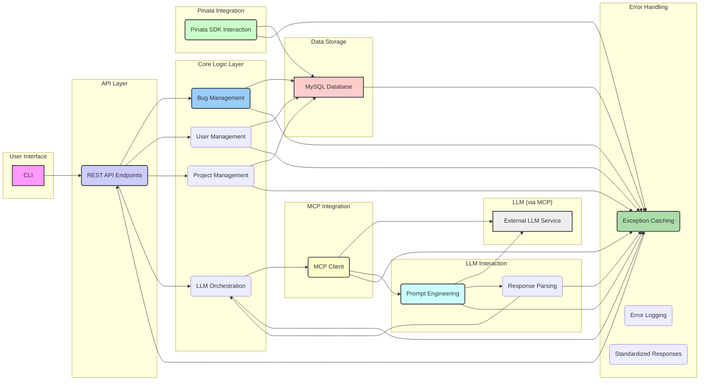

# AIBugReport: Intelligent Bug Tracking CLI

[](https://www.python.org/)
[](https://www.apache.org/licenses/LICENSE-2.0)


**AIBugReport** is a command-line interface (CLI) tool designed for efficient and intelligent bug tracking. Leveraging the power of Large Language Models (LLMs) and decentralized storage, it aims to streamline the bug reporting workflow and provide developers with comprehensive information to resolve issues quickly.

## Key Features

* **CLI-Centric Interface:** A powerful and efficient command-line interface for all bug tracking operations.
* **Intelligent Bug Analysis:** Automatically suggests potential categories and severity levels for new bug reports using LLM analysis (via MCP - Model Context Protocol).
* **Rich Attachment Support:** Easily attach screenshots and detailed documentation to bug reports via the CLI, utilizing decentralized storage powered by Pinata (IPFS).
* **Project Organization:** Organize and track bug reports by project within the CLI for effective management and prioritization.
* **MySQL Database:** Robust and reliable storage of structured bug report data using MySQL.
* **Extensible Architecture:** Modular design allowing for future enhancements, including potential integration with AI agents supporting the Google Agent-to-Agent protocol.
* **Error Handling:** Comprehensive error handling layer for a stable and user-friendly experience.

## Inspiration

**AIBugReport** is inspired by the need for a more intelligent and efficient bug tracking system that addresses the limitations of traditional tools. It aims to:

* Enhance bug reporting efficiency by automating categorization and providing suggestions.
* Leverage AI to provide deeper understanding of bug reports.
* Enable rich contextual information through decentralized attachment storage.
* Offer efficient project organization within a CLI environment.
* Provide a developer-centric tool with a powerful command-line interface.

## User Stories

* **As a software tester,** I want to attach screenshots and detailed documentations to the bug reports I submit via the CLI, so that developers have comprehensive visual and contextual information to understand and resolve the issues efficiently.
* **As a project manager,** I want to organize bug reports by project within the CLI, so that I can easily track the status and progress of issues specific to each project and prioritize them effectively.
* **As a software developer,** I want the system to automatically suggest potential categories and severity levels for new bug reports submitted via the CLI, based on LLM analysis of the description, so that I can quickly understand the nature and urgency of the issue and start working on it faster.

## Acceptance Criteria (Examples)

**Attach Screenshots and Documentation:**

1.  **Given** I am submitting a bug report via the CLI
    **When** I specify one or more valid file paths using the attachment argument
    **Then** the system should upload these files to Pinata.
    ... (more criteria)

**Organize by Project:**

1.  **Given** I am submitting a bug report via the CLI
    **When** I specify a valid project ID or name using the project association argument
    **Then** the newly created bug report should be associated with the specified project.
    ... (more criteria)

**LLM Suggestion:**

1.  **Given** I am submitting a new bug report via the CLI and have entered a description
    **When** I finalize the bug report submission
    **Then** the system should send the bug description to the LLM for analysis.
    ... (more criteria)

## Architecture



## Getting Started

*(This section will be expanded with installation and usage instructions as the project develops.)*

### Prerequisites

  * Python 3.x
  * MySQL Database (configure via environment variables: MYSQL_HOST, MYSQL_PORT, MYSQL_USER, MYSQL_PASSWORD, MYSQL_DATABASE)
  * Pinata API credentials (set environment variables: PINATA_API_KEY, PINATA_API_SECRET)
  * Google Gemini API key (set environment variable: GOOGLE_API_KEY)
  * (Optional) LLM model name (set environment variable: GOOGLE_API_MODEL; default: gemini-1.5-flash-latest)

### Installation

```bash
# Clone and install dependencies
git clone https://github.com/tonycai/AIBugReport.git
cd AIBugReport
pip install -r requirements.txt

# Configure environment variables for database, Pinata, and Google Gemini API
export MYSQL_HOST=127.0.0.1           # or your MySQL host
export MYSQL_PORT=3306                # or your MySQL port
export MYSQL_USER=root                # or your MySQL user
export MYSQL_PASSWORD=<your_mysql_password>  # set your MySQL password
export MYSQL_DATABASE=aibugrepot_db    # or your MySQL database name
export PINATA_API_KEY=<your_pinata_api_key>
export PINATA_API_SECRET=<your_pinata_api_secret>
export PINATA_JWT=<your_pinata_jwt>
export GOOGLE_API_KEY=<your_google_api_key>
export GOOGLE_API_MODEL=gemini-1.5-flash-latest  # optional, defaults to gemini-1.5-flash-latest
```

### Usage

```bash
# Example commands (will be updated)
aibug report --title "UI issue on login" --description "The login button is not working..." --attach screenshot.png
aibug list --project "WebApp"
# ... more commands to interact with the system
```

## Future Enhancements

  * Integration with AI agents supporting the Google Agent-to-Agent protocol for automated triage, assignment, and more.
  * Web interface for broader accessibility.
  * More advanced LLM-powered features, such as duplicate detection and suggested resolutions.
  * Notifications and alerts.
  * User roles and permissions management.

## Contributing

*(This section will be added with guidelines for contributing to the project.)*

## License

This project is licensed under the Apache License 2.0 - see the LICENSE file for details.

## Acknowledgements

  * The Python community for its excellent libraries and tools.
  * The developers of Pinata and the MCP protocol.
  * The creators of the LLM used in this project.
